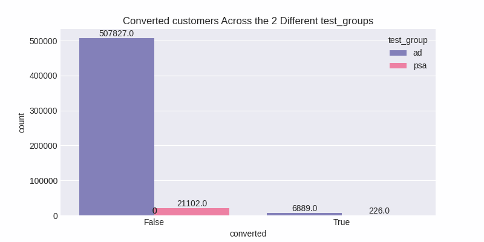
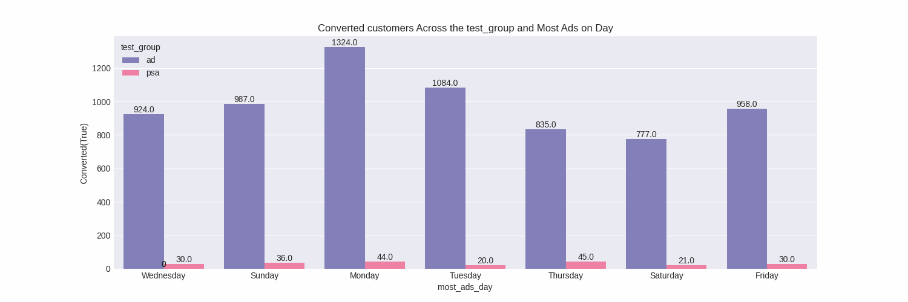
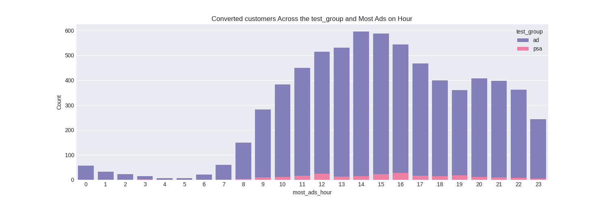
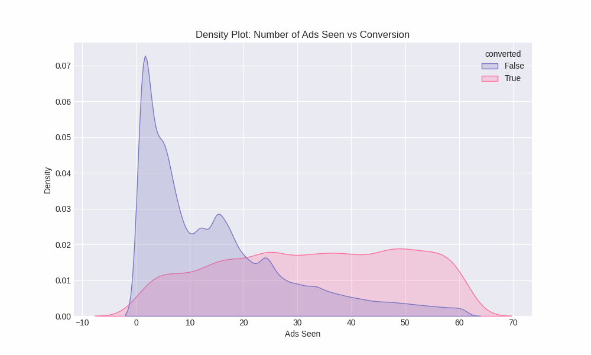

# split_decision_analytics


[](https://github.com/ellerbrock/open-source-badges/)

Badge [source](https://shields.io/)


## Authors

- [@Usama-zia](https://www.github.com/Usama-zia)

## Table of Contents

  - [Objective](#objective)
  - [Data source](#data-source)
  - [Questions to Explore](#questions-to-explore)
  - [Quick Glance at the Results](#quick-glance-at-the-results)
  - [Conclusions and Recommendations](#conclusions-and-recommendations)
  - [Future Work](#future-work)
  - [Key Takeaways for Future Work](#key-takeaways-for-future-work)
  - [Methods](#methods)
  - [Tech Stack](#tech-stack)
  - [Installation and Usage](#installation-and-usage)
  - [Explore the notebook](#explore-the-notebook)
  - [Repository structure](#repository-structure)
  - [License](#license)


## Objective

This notebook aims to analyze the effectiveness of an ad campaign compared to a public service announcement (PSA) approach in driving conversions. The analysis focuses on identifying key factors that influence conversion rates and providing actionable insights for optimizing ad campaigns to maximize return on investment.

## Questions to Explore
Following Questions are needed to be answerd:

1. What is the conversion rate for the experimental group (ad) versus the control group (PSA)?
 
2. Is there a statistically significant difference in conversion rates between the two test groups(ad and psa)? What is the confidence interval for the difference in conversion rates between the two groups (ads and psa)?

3. Does the number of ads seen by a person correlate with a higher likelihood of conversion?

4. Is there an optimal number of ads that maximizes conversion rates?

5. which day of the week is ad exposure most effective in driving conversions? Is there a significant difference in conversion rates based on the day of the week users were most exposed to ads?

6. At what hour of the day ad exposure is most effective in driving conversion? Is there a significant difference in conversion rates based on the hour of the day users were most exposed to ads?

7. How much of the observed conversions can be directly attributed to ad exposure? What is the incremental lift in conversions due to the ad campaign compared to the PSA?

## Data source

- [Dataset](https://www.kaggle.com/datasets/faviovaz/marketing-ab-testing)
- This dataset is also provided in the repository.

Data Overview
| Column Name     	                | Description 	|
|-------------------	        |------------------	|
| Index | Row index               |
| user id | User ID (unique)        |
| test_group | If "ad" the person saw the advertisement, if "psa" they only saw the public service announcement      |
| converted | If a person bought the product then True, else is False          |
| total_ads | Number of ads seen by person        |
| most_ads_day | Day that the person saw the biggest amount of ads        |
| most_ads_hour | Hour of day that the person saw the biggest amount of ads      |

## Quick glance at the results

Number of Conversions Aross Both Groups



Converted customers Across the ad and psa groups and Most Ads seen on Day



Converted customers Across the ad and psa groups and Most Ads seen on Hour



Conversion based on the number of ads seen



## Conclusions and Recommendations

### Conclusions
Based on the analysis conducted in this notebook, we can draw the following conclusions:

- The ad campaign has a positive impact on conversion rates compared to the PSA group.

- The optimal number of ads seen to maximize conversion rates is around 61.

- Monday is the most effective day for ad exposure in driving conversions.

- 4:00 PM is the most effective hour for ad exposure in driving conversions.

- There is a significant difference in conversion rates based on the day and hour of the week users were most exposed to ads.

- While it's challenging to directly attribute conversions solely to ad exposure, the analysis suggests a significant incremental lift in conversions due to the ad campaign.

### Recommendations
Based on the findings, we recommend the following actions:

- Optimize ad frequency: Focus on delivering around 61 ads to users to maximize conversion rates.

- Prioritize ad delivery on Mondays: Allocate a larger portion of the ad budget to Monday to capitalize on the higher conversion rates observed on this day.

- Target ad delivery around 4:00 PM: Schedule ad campaigns to reach users around 4:00 PM when they are more likely to convert.

- Continue monitoring and refining ad campaigns: Regularly analyze conversion data and adjust ad targeting, creative, and delivery strategies to further improve performance.

- Explore advanced attribution models: Consider implementing multi-touch attribution models to gain a more comprehensive understanding of the impact of ad exposure within the broader marketing mix.

- Invest in user segmentation: Leverage data to create personalized ad experiences for different user segments to improve engagement and conversion rates.

By implementing these recommendations, We can further optimize its ad campaigns and maximize the return on investment.

## Future Work

Explore Datasets that have information on users such as Demographics (age, gender, location, etc.), Product categories viewed, and Previous purchase history (if available).

Some other questions That can be answered for this dataset and others as well:
1. On which day of the week and at what hour is ad exposure most effective in driving conversions?

2. Are there specific days or hours where the difference in conversion rates between the ad and PSA groups is most pronounced?

3. How much revenue can be attributed to the ads if the average revenue per conversion is known?

4. What is the potential revenue difference between the ad group and the PSA group?

5. Are there specific user segments (based on the number of ads seen, day, hour) that respond better to ads?

6. How do conversion rates vary among different segments within the ad group?

## Key Takeaways for Future Work

Directly attributing conversions or incremental lift in conversions solely to ad exposure involves several challenges and considerations:

#### Challenges in Attribution

1. **Selection Bias**: Users who see the ad might already be more predisposed to purchase, leading to overestimation of the ad's impact.
2. **Multiple Touchpoints**: Users might encounter various marketing efforts (organic search, social media) before converting, making it difficult to isolate the ad's specific influence.
3. **Attribution Models**: Different models allocate credit for a conversion across various touchpoints, influencing the perceived impact of ads.

#### Approaches for Attribution Analysis

1. **Uplift Modeling**:
   - Requires a control group with similar characteristics who didn't see the ad.
   - Compare conversion rates between the ad group and the control group to estimate incremental lift.

2. **Difference-in-Differences (DID)**:
   - Use historical data on conversion rates before and after the ad campaign for both groups.
   - Assumptions:
     - Trends in conversion rates for both groups would have been similar without the ad campaign.
     - No other significant events influenced conversion rates.
   - Calculation: DID = Treatment Group Difference - Control Group Difference 

   where 
    - Treatment Group Difference = Treatment_Post - Treatment_Pre
    - Control Group Difference = Control_Post - Control_Pre

   - Positive lift suggests the ad campaign increased conversions compared to the PSA group.

3. **Observational Techniques**:
   - **Matching Techniques**: Match users in the ad group with similar users in the PSA group based on characteristics and analyze the difference in conversion rates. Selection bias might still be an issue.
   - **Interrupted Time Series Analysis**: Analyze historical conversion rate data for both groups before, during, and after the ad campaign. Look for a sudden change in the ad group's conversion rate coinciding with the campaign launch. External factors might influence the observed changes.

4. **Lift Charts**:
   - Visualize the conversion rate over time for both groups. Look for a significant increase in the ad group's conversion rate after ad exposure. External factors might influence the observed changes.

5. **Contribution Analysis (Multi-Touch Attribution Model)**:
   - Use a multi-touch attribution model (e.g., U-shaped, W-shaped) to consider various touchpoints users encounter before conversion. Provides insights into the percentage of credit assigned to the ad exposure within the model. However, it's not a definitive measure of direct attribution.

#### Interpretation and Limitations

- **Uplift Modeling**: Provides the most reliable estimate, but ethical considerations for the control group are crucial.
- **DID and Observational Techniques**: Offer alternatives but have limitations due to potential confounding factors.
- **Lift Charts and Contribution Analysis**: Useful for visualizing impact but should be interpreted cautiously.

#### Additional Considerations

- Monitor other user behavior metrics (clicks, website visits) alongside conversions to understand the ad campaign's influence on user engagement.
- Track changes in user behavior after ad exposure (e.g., increased website visits, product page views) to gauge potential ad influence.

By employing these methods and recognizing their limitations, we can gain valuable insights into the potential incremental lift in conversions attributable to our ad campaign compared to the PSA approach.

#### Key Takeaways

- Focus on understanding the overall impact of the ad campaign on conversions, considering the limitations.
- Use a combination of methods to estimate the incremental lift in conversions and interpret the results as an estimate, not a definitive measure of the ad campaign's direct impact.

## Methods

- Exploratory data analysis
- A/B Testing
- Correlation Analysis
- Attribution Analysis
  
## Tech Stack

- Python
  - Pandas
  - NumPy
  - Matplotlib
  - Seaborn
  - re (regular expressions)
  - statsmodels
  - SciPy
  - scikit-learn  

## Limitations and what can be improved

- Current dataset does not have enought information on user demographics or behaviour more explorations is requried.
-  More exploration for designing A/B tests in real world situations for marketing, finance and A/B testing for ML models, where two different model's are deployed and their performance is evaluated against each other after deployment.


## Installation and Usage

Prerequisites:

A Google account (for accessing Google Colab)

Steps:

1. Clone the Repository using this link 'https://github.com/Usama-zia/split_decision_analytics.git'

2. Open Google Colab (https://colab.research.google.com/).

3. In the top left corner, click on "File" -> "Open notebook from URL".

4. Paste the copied repository URL into the provided field and click "Open notebook".

Mount Google Drive:

1. Colab menu bar, navigate to "Runtime" -> "Change runtime type".

2. Select "Python 3" (or a compatible version) and ensure a GPU or TPU is enabled if desired for faster computations (availability may vary).

3. Click on "Save" to apply the changes.

4. Run the following code cell in the notebook:


```bash
from google.colab import drive
drive.mount('/content/drive')
```
Use code with caution.

Follow the on-screen instructions to authenticate your Google account. This will mount your Google Drive and make it accessible within the Colab environment at the /content/drive directory.
Run the Notebook:

Click on the "Cell" menu bar option and select "Run all cells" to execute all code blocks in the notebook sequentially. Alternatively, you can press "Shift + Enter" to run a single code block at a time.
Additional Notes:

## Explore the notebook

To explore the notebook file [here](https://nbviewer.org/github/semasuka/Credit-card-approval-prediction-classification/blob/main/Credit_card_approval_prediction.ipynb)

## Repository structure


```

├── assets
│   ├── density_seen.png                      <- density plot image used in the README.
│   ├── no_of_conversions.png                 <- count plot image in the README.
│   ├── per_day.png                           <- bar plot image used in the README.
│   ├── per_hour.png                          <- bar plot image used in the README.

├── data
│   ├── interim                    
│   ├── processed                        
│   ├── raw                                
│   ├── marketing-ab-testing.zip              <- dataset (zip file).
│
│
├── .gitignore                                <- used to ignore certain folder and files that won't be commit to git.
│
│
├── SplitTest_Marketeer.ipynb                 <- main python notebook where all the analysis and modeling are done.
│
│
├── LICENSE                                   <- license file.
│
│
├── README.md                                 <- this readme file.

```

## License

MIT License

Learn more about [MIT](https://choosealicense.com/licenses/mit/) license
